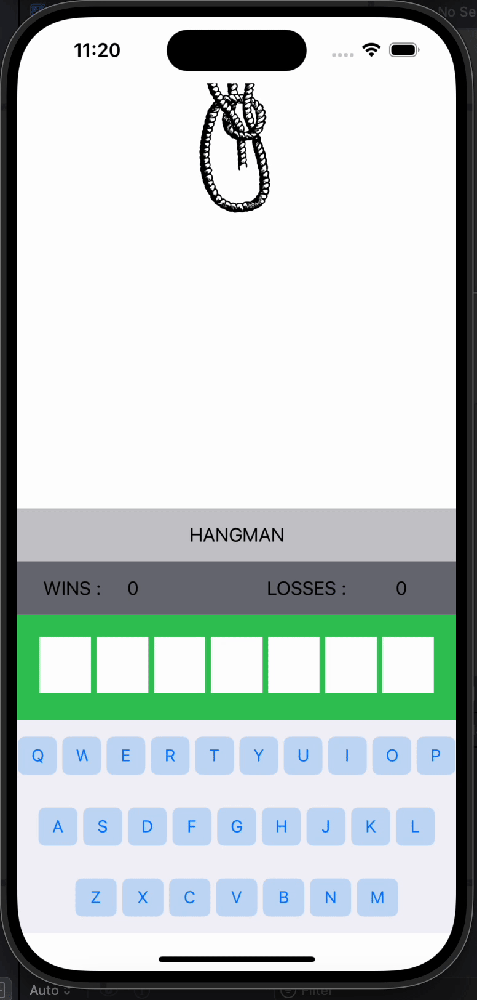

# Hang-Man-iOS-Game

This is a Hang Man game iOS app built using UIKit and Swift.

## Features

- Play the classic Hang Man game with a random selection of seven-letter words.
- Track your wins and losses.
- Visual representation of the hangman with images.
- Interactive keyboard for guessing letters.
- Alerts for winning or losing the game with options to play again.

## Demo



## Project Structure
HangMan/ ├── HangMan/AppDelegate.swift ├── Assets.xcassets/ │ ├── AccentColor.colorset/ │ ├── AppIcon.appiconset/ │ ├── HangMan/Assets.xcassets/AccentColor.colorset/Contents.json │ ├── img_1.imageset/ │ ├── img_2.imageset/ │ ├── img_3.imageset/ │ ├── img_4.imageset/ │ ├── img_5.imageset/ │ ├── img_6.imageset/ │ └── img_7.imageset/ ├── Base.lproj/ │ ├── HangMan/Base.lproj/LaunchScreen.storyboard │ └── HangMan/Base.lproj/Main.storyboard ├── const/ │ └── HangMan/const/words.swift ├── HangMan/Info.plist ├── HangMan/SceneDelegate.swift └── HangMan/ViewController.swift HangMan.xcodeproj ├── HangMan.xcodeproj/project.pbxproj └── project.xcworkspace/ ├── HangMan.xcodeproj/project.xcworkspace/contents.xcworkspacedata └── xcuserdata/

## Getting Started

### Prerequisites

- Xcode 12.0 or later
- iOS 14.0 or later

### Installation

1. Clone the repository:
    ```sh
    git clone https://github.com/yourusername/HangMan.git
    ```
2. Open the project in Xcode:
    ```sh
    cd HangMan
    open HangMan.xcodeproj
    ```
3. Build and run the project on a simulator or a physical device.

## Usage

- Launch the app.
- Use the on-screen keyboard to guess letters.
- The game will track your correct and incorrect guesses.
- Win by guessing all the letters correctly before the hangman is fully drawn.
- Lose if the hangman is fully drawn before you guess the word.

## Contributing

Contributions are welcome! Please open an issue or submit a pull request.

## License

This project is licensed under the MIT License. See the [LICENSE](LICENSE) file for details.

## Acknowledgements

- Developed by Lalana Thanthirigama
- Inspired by the classic Hang Man game